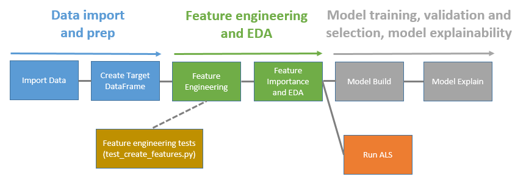

# Grocery recommender system

#### About this project

This project builds a recommender system for a grocery store.  It utilizes data on customer behavior over a 52 week period in order to predict items a customer is likely to purchase in the following week (illustrated below):

A recommender engine such as this could be utilized to:

1.	Create a personalized digital flyer highlighting to each customer the items on sale that week that are most relevant for them
2.	Generating automated weekly shopping lists
3.	Reminding customers shopping on-line of items they may have forgotten to purchase i.e. items with high predicted relevancy for that week they did not purchase

The recommender system is built utilizing matrix factorization techniques commonly used in recommender systems (specifically ALS) but also combines ML classification models and a simple DNN that add contextual features e.g. average customer purchase cycle for an item in order to predict the probability that a customer will purchase an item in a given week.  

#### Motivation

The project was completed as a capstone submission for the Udacity Machine Learning Engineer Nanodegree.  The final submission can be viewed in the PDF titled 'Udacity ML Engineer Capstone Submission' in the repo

#### Data required to run the code

The data used to build the recommender system was provided open source by Dunnhumby, a global leader in retail analytics.  The dataset contained a sample of 117 weeks of ‘real’ customer data from a large grocery store constructed to replicate typical pattern found in in-store data to allow the development of algorithms in a (near) real-world environment.  The dataset can be downloaded from the following location:

https://www.dunnhumby.com/careers/engineering/sourcefiles

The actual data utilized was from the “Let’s get sort of real” section, specifically the data from a randomly selected group of 5,000 customers

#### Libraries required to run the code

The code has been written with Python 3 utilizing the Amazon Sagemaker framework for model training. All required libraries are contained within the requirements.txt file

#### How to run the code:

Each of the modules within the code should be run according to the DAG shown below:

Code is executed via the IPython Notebooks, with each notebook calling the relevant classes and functions within the module as required

#### Tests:

Each of the functions within the Feature Engineering module contains a unit test that can be run with PyTest.  In order to run the tests navigate to the Feature Engineering module and run test_create_features.py in the command line
